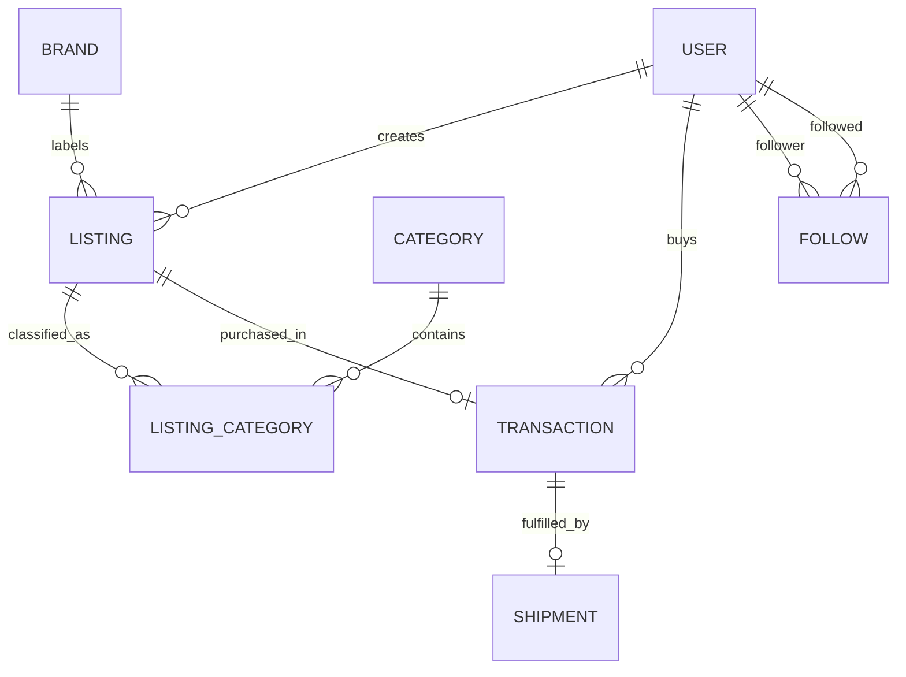

# Depop Marketplace SQL Database

An end-to-end PostgreSQL project modelling a second-hand fashion marketplace in Australia—from relational schema design and data-quality controls to reusable reporting views and business analysis.

## Objective

Design a reliable database that supports the core operations of a fashion resale marketplace and answers practical questions about listings, sales, customers, brands, fulfilment, and user engagement.

## Table of contents

- [Business results](#business-results)
- [Recommendations](#recommendations)
- [Dataset](#dataset)
- [Tools and techniques](#tools-and-techniques)
- [Data model](#data-model)
- [Database structure](#database-structure)
- [Analysis included](#analysis-included)
- [How to run](#how-to-run)

## Business results

The repository contains a deliberately small synthetic dataset for demonstrating the database design. Results below describe that sample only; they are not claims about Depop's real business.

| Metric | Sample result |
|---|---:|
| Completed gross merchandise value | AUD 380 |
| Platform fees from completed transactions | AUD 38 |
| Average rating across rated purchases | 4.4 / 5 |
| Listings without a transaction | 1 of 8 |
| Mutual follow relationships | 2 pairs |

The analysis also identifies brand-level listing volume and average price, connects purchases to buyers, and surfaces inventory that has not sold.

## Recommendations

Based on the included sample:

1. Create an unsold-listing workflow so sellers can review price, description, and presentation for inventory with no transaction.
2. Track rating coverage as well as average rating; one completed purchase has no rating, so the average alone does not represent every transaction.
3. Report platform fees alongside completed GMV to monitor monetisation, while keeping pending, cancelled, and refunded transactions separate.
4. Use mutual-follow relationships as a starting point for testing whether social engagement is associated with marketplace activity.

These are analytical hypotheses for a portfolio demonstration and would need validation on production-scale data before a business decision.

## Dataset

The SQL script creates synthetic sample data for:

- 6 users
- 5 brands and 5 categories
- 8 product listings
- 7 transactions
- 6 shipments
- 7 follow relationships

No private or scraped customer data is used.

## Tools and techniques

- **Database:** PostgreSQL
- **SQL:** joins, aggregations, subqueries, `NOT EXISTS`, self-joins, and views
- **Data modelling:** one-to-many, many-to-many, and self-referencing relationships
- **Data quality:** primary and foreign keys, `CHECK`, `UNIQUE`, and `NOT NULL` constraints

## Data model



## Database structure

| Table | Purpose |
|---|---|
| `USER` | Stores marketplace user accounts |
| `BRAND` | Stores fashion brand information |
| `CATEGORY` | Stores listing categories |
| `LISTING` | Stores items offered for sale |
| `LISTING_CATEGORY` | Connects listings and categories |
| `TRANSACTION` | Records purchases and customer feedback |
| `SHIPMENT` | Tracks delivery details |
| `FOLLOW` | Represents social-following relationships between users |

## Reusable SQL views

### `vw_listing_details`

Combines listing, seller, brand, and category information into a reusable view.

### `vw_user_transaction_summary`

Summarises each user's purchase count, total spending, and average rating given.

## Analysis included

The included queries demonstrate how to:

- Find listings above a selected price
- Connect transactions with buyer information
- Compare listing counts and average prices by brand
- Identify listings that have never been purchased
- Find pairs of users who follow each other

## Repository Contents

```text
depop-marketplace-sql-database/
├── README.md
└── depop_marketplace.sql
```

## How to run

1. Install PostgreSQL.
2. Create an empty database.
3. Run the SQL file:

```bash
psql -d your_database_name -f depop_marketplace.sql
```

The script removes existing project objects, recreates the database structure, inserts sample data, creates the views, and runs the example queries.

## Author

Wan-Lin Yang

Master of Information Technology student at the University of Technology Sydney.

## Project context

This project was completed independently as an academic database assignment. The repository version has been reorganised for portfolio presentation and excludes student identification details.
